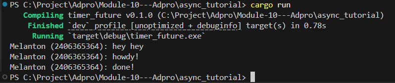

# Async Tutorial

## Experiment 1.2: Non-blocking nature


*(Please place your screenshot in an `images` folder and name it `experiment_1_1.png`, or update the path above to match your image file!)*

### Explanation

When running the updated `main.rs`, the output appears in the following order:

1. `Melanton (2406365364): hey hey`
2. `Melanton (2406365364): howdy!`
3. `Melanton (2406365364): done!`

**Why does this happen?**

In `main.rs`, we added the print statement `"hey hey"` outside the async block, right after calling `spawner.spawn(...)`:

```rust
spawner.spawn(async {
    println!("Melanton (2406365364): howdy!");
    TimerFuture::new(Duration::new(2, 0)).await;
    println!("Melanton (2406365364): done!");
});

println!("Melanton (2406365364): hey hey");
```

Even though `spawner.spawn` is called *before* the synchronous `println!("... hey hey")`, the code inside the spawned async block doesn't execute right away. 

1. **Task Queuing**: Calling `spawner.spawn` simply packages the `async` block into a task and pushes it onto the executor's task queue (a channel). It does **not** execute the task immediately.
2. **Synchronous Execution**: Since `spawner.spawn` is non-blocking, the main thread immediately moves on to the next line and executes `println!("Melanton (2406365364): hey hey")`. 
3. **Task Execution**: The execution of our async task only begins when we call `executor.run()` at the end of the `main` function. The executor pulls the task from the queue and starts polling it, which is when `"howdy!"` and `"done!"` are finally printed.

Because synchronous code executes immediately while asynchronous tasks wait for the executor to run them, `"hey hey"` gets printed first!


